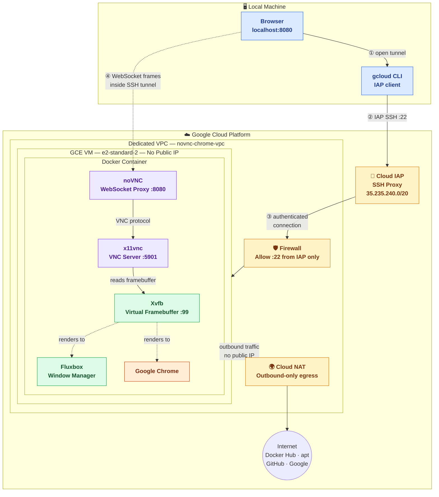

# noVNC Chrome Desktop

> A fully containerised, browser-accessible Chrome desktop running on a **headless GCP VM with no public IP** — provisioned with a single command.

This project packages Google Chrome inside a virtual desktop (Xvfb + Fluxbox), exposes it over VNC, and wraps that in a noVNC WebSocket proxy so any modern browser can connect. Access is secured end-to-end through Google Cloud IAP — no open ports, no VPN, no static IP charges.

---

## Table of Contents

- [Architecture](#architecture)
- [How the Display Stack Works](#how-the-display-stack-works)
- [Security Model](#security-model)
- [Prerequisites](#prerequisites)
- [Quick Start](#quick-start)
- [Daily Use](#daily-use)
- [Configuration Reference](#configuration-reference)
- [Cost Estimate](#cost-estimate)
- [Tab Capacity Estimate](#tab-capacity-estimate)
- [Local Development](#local-development)
- [Makefile Reference](#makefile-reference)
- [Troubleshooting](#troubleshooting)
- [Teardown](#teardown)

---

## Architecture



| Colour | Layer | Components |
|---|---|---|
| 🔵 Blue | Local machine | Browser, gcloud CLI |
| 🟡 Amber | GCP security & networking | Cloud IAP, Cloud NAT, Firewall |
| 🟢 Green | Virtual display | Xvfb (framebuffer), Fluxbox (window manager) |
| 🟣 Purple | VNC protocol layer | x11vnc (VNC server), noVNC (WebSocket proxy) |
| 🟠 Orange | Browser | Google Chrome |

### Infrastructure summary

| Resource | Name | Purpose |
|---|---|---|
| GCE VM | `novnc-chrome` | Runs the Docker container |
| VPC network | `novnc-chrome-vpc` | Dedicated, isolated network — no default network |
| Subnet | `novnc-chrome-subnet` | `10.0.0.0/24`, Private Google Access enabled |
| Cloud Router + NAT | `novnc-chrome-nat` | Outbound internet without a public IP |
| Firewall | `novnc-chrome-allow-iap-ssh` | SSH on `:22` from IAP range only |
| Service account | `novnc-chrome-sa` | Least-privilege VM identity |

---

## How the Display Stack Works

Understanding the display pipeline helps when debugging. The chain has four hops:

```
Chrome / Fluxbox
      │  render pixels to
      ▼
   Xvfb (:99)          ← virtual framebuffer; a fake monitor in RAM
      │  shared via X11 display
      ▼
   x11vnc              ← reads the X11 framebuffer, speaks VNC protocol on :5901
      │  VNC (RFB protocol, binary)
      ▼
   noVNC               ← translates VNC ↔ WebSocket; serves the HTML5 client on :8080
      │  WebSocket (inside SSH tunnel)
      ▼
 Your browser          ← renders the desktop via the noVNC JavaScript client
```

**Why not run Chrome headlessly?** Headless Chrome (`--headless`) drops the GPU/compositor pipeline, breaking many sites. This setup runs Chrome in a *real* (virtual) X11 display, giving full rendering fidelity — the same experience as a physical monitor.

**Why Xvfb + x11vnc instead of a VNC server like TigerVNC?** Xvfb creates a display that is already shared on the standard X11 socket. x11vnc attaches to that socket and forwards it over VNC without requiring a separate windowing session. This means any X11 application — including Chrome — simply sets `DISPLAY=:99` and renders normally.

**Supervisor startup order** (enforced by `priority` in `supervisord.conf`):

```
priority 100 → Xvfb          (display must exist first)
priority 150 → Fluxbox        (window manager attaches to the display)
priority 180 → VNC password   (write ~/.vnc/passwd once)
priority 200 → x11vnc         (attach to the display over VNC)
priority 300 → noVNC          (proxy VNC to WebSocket)
priority 350 → Chrome         (launch browser into the ready desktop)
```

---

## Security Model

This project is designed so that **zero TCP ports are reachable from the public internet**.

| Threat | Mitigation |
|---|---|
| Direct port scan | VM has no public IP; no route to reach it |
| Brute-force SSH | SSH port only accepts connections from `35.235.240.0/20` (Google IAP range) |
| Exposed VNC | Ports `:5901` and `:8080` are bound to `127.0.0.1` inside the container, never to the VM's network interface |
| Default-network risk | A dedicated VPC is created. The `default` network (with its permissive auto-rules) is never used |
| Credential leakage | `.env` and `terraform.tfvars` are `.gitignore`d. `VNC_PASSWORD=changeme` is a hard error that blocks all build commands |
| Unauthorised tunnel | IAP verifies Google identity before forwarding. Terraform grants `roles/iap.tunnelResourceAccessor` only to the deploying user |

> **For team use:** Add additional users to the IAP role with:
> ```bash
> gcloud projects add-iam-policy-binding YOUR_PROJECT_ID \
>   --member="user:colleague@example.com" \
>   --role="roles/iap.tunnelResourceAccessor"
> ```

---

## Prerequisites

| Tool | Version | Purpose |
|---|---|---|
| [Docker](https://docs.docker.com/get-docker/) | Any recent | Local development and image builds |
| [Terraform](https://developer.hashicorp.com/terraform/install) | ≥ 1.5 | Infrastructure provisioning |
| [Google Cloud SDK](https://cloud.google.com/sdk/docs/install) | Any recent | VM access, IAP tunneling, `gcloud` CLI |
| GCP project | Billing enabled | Hosting the VM |

### Authentication — two logins required

`gcloud` uses two separate credential stores for two separate purposes:

```bash
# 1. Authenticates the gcloud CLI (used for: compute ssh, compute scp, instances start/stop)
gcloud auth login

# 2. Stores Application Default Credentials (ADC) — used by the Terraform Google provider
gcloud auth application-default login
```

> Without ADC, `terraform apply` fails with `"could not find default credentials"` even when `gcloud compute ssh` works perfectly. They are independent credential stores.

Verify both are configured before proceeding:

```bash
make check
```

---

## Quick Start

### Step 1 — Clone and configure

```bash
git clone <repo-url> novnc-chrome-desktop
cd novnc-chrome-desktop
```

Copy the environment template and fill in the two required values:

```bash
cp .env.example .env
```

```env
# Minimum required changes:
PROJECT_ID=your-gcp-project-id    # your GCP project
VNC_PASSWORD=a-strong-password    # minimum 8 characters; 'changeme' is rejected
```

> **Security note:** `VNC_PASSWORD=changeme` is enforced as a hard error. Every `make build`, `make up`, and `make push` will refuse to proceed until a real password is set.

### Step 2 — First-time setup

```bash
make setup
```

`make setup` does three things automatically:
1. Reads `.env` and generates `terraform/terraform.tfvars` — no manual file copying
2. Runs `terraform init`
3. Enables the required GCP APIs (`compute`, `iap`) in isolation, then **waits 60 seconds** for them to propagate before the full infrastructure apply runs

> The API wait exists because GCP enables APIs asynchronously. Attempting to create a VM or firewall rule before the Compute API is fully active causes intermittent Terraform errors on first deploy.

### Step 3 — Deploy

```bash
make deploy
```

This runs the full deployment pipeline:

| Phase | Command | What happens |
|---|---|---|
| 1 | `tf-apply` | Terraform provisions VPC, subnet, Cloud NAT, firewall, service account, IAP grant, and the VM |
| 2 | `push` | Files synced to VM via IAP; Docker image built on VM (Chrome downloaded); container started |
| 3 | `status` | Prints VM state and access instructions |

> **First deploy takes 5–8 minutes.** The VM startup script installs Docker, then the Docker build downloads Chrome (~200 MB). Subsequent deploys reuse Docker layer cache and complete in ~1 minute.

### Step 4 — Connect

```bash
make tunnel
```

This opens an IAP SSH tunnel that forwards `localhost:8080` on your machine to port `8080` on the VM. Then open in your browser:

```
http://localhost:8080
```

Enter the `VNC_PASSWORD` from `.env`. You will see a full Linux desktop with Chrome running.

**Auto-stop on disconnect:** When you close the tunnel with `Ctrl+C`, a 10-second countdown begins before the VM is stopped. Press `Ctrl+C` again during the countdown to cancel and keep the VM running. This prevents idle compute charges.

**Auto-update Chrome:** Every time `make tunnel` runs, the script connects to the VM and compares the Chrome version in the running container against the latest available in Google's apt repository. If an update is available, it triggers a `docker compose up -d --build` on the VM before opening the tunnel — ensuring you always have the latest Chrome without any manual intervention.

**Persistent Chrome profile:** Cookies, saved passwords, browsing history, and extensions are stored in a Docker named volume (`chrome-data`). The profile survives container restarts, image rebuilds, and VM stop/start cycles. It is only wiped if you explicitly run `docker compose down -v`.

---

## Daily Use

```bash
make tunnel     # Start VM if stopped → check Chrome update → open tunnel → auto-stop on exit
make vm-start   # Start a stopped VM without opening a tunnel
make vm-stop    # Stop the VM immediately (disk and Chrome profile preserved)
make status     # Show VM power state and connection instructions
make push       # Re-sync local file changes and restart the container (no Terraform re-run)
make ssh        # Open a raw SSH session on the VM via IAP
```

---

## Configuration Reference

All configuration lives in `.env`. Run `make setup` after any change to propagate values to `terraform.tfvars`.

### App settings (Docker container)

| Variable | Default | Description |
|---|---|---|
| `VNC_PASSWORD` | *(required)* | noVNC login password. `changeme` is rejected. |
| `RESOLUTION` | `1920x1080x24` | Virtual display resolution: `WxHxBitDepth` |
| `RESOLUTION_WIDTH` | `1920` | Chrome window width (keep in sync with `RESOLUTION`) |
| `RESOLUTION_HEIGHT` | `1080` | Chrome window height |

### Infrastructure settings (Terraform)

| Variable | Default | Description |
|---|---|---|
| `PROJECT_ID` | *(required)* | GCP project ID |
| `REGION` | `us-central1` | GCP region for all resources |
| `ZONE` | `us-central1-a` | GCP zone for the VM |
| `VM_NAME` | `novnc-chrome` | Instance name; also prefixes all associated resources |
| `MACHINE_TYPE` | `e2-standard-2` | 2 vCPU / 8 GB RAM |
| `DISK_SIZE_GB` | `50` | Boot disk size in GB (SSD) |
| `PREEMPTIBLE` | `false` | Spot VM — ~70% cheaper but GCP may reclaim it |
| `SUBNET_CIDR` | `10.0.0.0/24` | Subnet range — change if it conflicts with VPC peering |

---

## Cost Estimate

> Prices for `us-central1`, April 2025. Verify current rates with the [GCP pricing calculator](https://cloud.google.com/products/calculator).

### On-demand VM (`e2-standard-2`, `PREEMPTIBLE=false`)

| Usage pattern | Compute | Disk (50 GB SSD) | **Total/month** |
|---|---|---|---|
| Always on (24 h/day) | ~$48.60 | $8.50 | **~$57** |
| 8 h/day · 20 days | ~$10.80 | $8.50 | **~$19** |
| 2 h/day · 20 days | ~$2.70 | $8.50 | **~$11** |

### Spot VM (`PREEMPTIBLE=true`) — ~70% cheaper

| Usage pattern | Compute | Disk | **Total/month** |
|---|---|---|---|
| 8 h/day · 20 days | ~$3.20 | $8.50 | **~$12** |
| 2 h/day · 20 days | ~$0.80 | $8.50 | **~$9** |

### What you are *not* paying for

- **No static IP:** The VM has no public IP, so there are no reserved-IP charges ($3.65/month when unattached).
- **No NAT egress beyond build time:** After the initial Docker image build, outbound traffic is minimal (Chrome update checks only).
- **No VPN or load balancer:** IAP SSH tunnel is a free GCP feature.

### Cost-saving recommendations

| Action | Saving |
|---|---|
| Use `make tunnel` (auto-stops VM on disconnect) | Only pay while actively using |
| Set `PREEMPTIBLE=true` | ~70% off compute |
| Downsize to `e2-medium` (1 vCPU / 4 GB) for light browsing | ~50% off compute |
| Reduce `DISK_SIZE_GB` to `30` | Save ~$3.40/month |

---

## Tab Capacity Estimate

> Based on `e2-standard-2` (2 vCPU / 8 GB RAM). Chrome isolates each tab in its own renderer process — one slow tab does not block others, but total memory is shared. An OOM event terminates the container process.

### Memory budget

| Component | Approximate memory |
|---|---|
| Docker daemon + system | ~150 MB |
| Xvfb + Fluxbox + x11vnc + noVNC | ~350 MB |
| Chrome browser process (base) | ~200 MB |
| **Headroom (swap buffer)** | **~300 MB** |
| **Available for tab renderers** | **≈ 7 GB** |

### Tab limits by workload type

| Tab type | Examples | Memory/tab | Safe limit | Crash threshold |
|---|---|---|---|---|
| Static / read-only | GitHub, docs, news | ~60 MB | **~30 tabs** | ~50 tabs |
| Typical web apps | Gmail, Sheets, Notion | ~200 MB | **~15 tabs** | ~25 tabs |
| Heavy / media | YouTube, Figma, SPAs | ~400 MB | **~8 tabs** | ~15 tabs |

### CPU guidance

2 vCPU handles background tabs and light interaction well. Performance degrades noticeably when more than **3–5 tabs are simultaneously executing JavaScript**. For continuous video playback or Figma, consider upgrading:

| Machine type | vCPU | RAM | Compute cost (on-demand) | Recommended for |
|---|---|---|---|---|
| `e2-medium` | 1 | 4 GB | ~$0.034/hr | Light browsing, <10 tabs |
| `e2-standard-2` *(default)* | 2 | 8 GB | ~$0.067/hr | General use, 15–20 tabs |
| `e2-standard-4` | 4 | 16 GB | ~$0.134/hr | Heavy use, video, 30+ tabs |

**If the container OOM-crashes**, the Docker restart policy (`unless-stopped`) restarts it automatically. To check status:

```bash
make ssh
cd /opt/novnc-chrome && sudo docker compose ps
sudo docker compose logs --tail=50
```

---

## Local Development

You can run the full stack locally (no GCP account or VM required) for testing changes:

```bash
make build   # build the Docker image (requires a real VNC_PASSWORD in .env)
make up      # start the stack; open http://localhost:8080
make logs    # stream supervisord + component logs
make down    # stop and remove containers (Chrome profile volume is preserved)
```

> Local mode uses the same Docker image and supervisord configuration as the GCP deployment, so behaviour is identical.

---

## Makefile Reference

```
First time
  setup           Read .env → generate terraform.tfvars → terraform init → enable APIs

Infrastructure
  tf-init         Initialise Terraform working directory
  tf-apis         Enable GCP APIs only, then wait 60 s for propagation
  tf-plan         Preview infrastructure changes without applying
  tf-apply        Provision all GCP resources (VPC, VM, NAT, IAP grant)
  tf-destroy      Destroy all provisioned GCP resources (irreversible)

Deployment
  deploy          Full pipeline: tf-apply → push
  push            Sync files to VM via IAP + rebuild and restart container

VM power
  vm-start        Start a stopped VM
  vm-stop         Stop the running VM (disk and profile preserved)

Access
  tunnel          Check Chrome update → open IAP tunnel → auto-stop VM on exit
  ssh             Open interactive SSH session on the VM via IAP
  status          Print VM power state and connection instructions

Local development
  build           Build Docker image locally
  up              Start stack locally
  down            Stop local stack
  logs            Stream local container logs

Utilities
  check           Verify all prerequisites (tools, gcloud auth, ADC, VNC password)
  help            Print this reference
```

---

## Troubleshooting

### `ERROR: VM not found`

The VM has not been provisioned yet, or was destroyed.

```bash
make tf-apply    # provision the VM
```

### `Permission denied` / `403` on IAP tunnel

Terraform grants `roles/iap.tunnelResourceAccessor` to the user who ran `make deploy`. If you are connecting from a different Google account:

```bash
gcloud projects add-iam-policy-binding YOUR_PROJECT_ID \
  --member="user:your-email@example.com" \
  --role="roles/iap.tunnelResourceAccessor"
```

### `ERROR: VNC_PASSWORD is still the default 'changeme'`

Edit `.env` and set `VNC_PASSWORD` to a real password, then retry. This check runs before every `make build`, `make up`, and `make push`.

### Blank or black screen after connecting

The display stack starts sequentially (Xvfb → Fluxbox → x11vnc → noVNC → Chrome). Full startup takes ~20 seconds after the container starts. Refresh the browser after 30 seconds. If it remains black:

```bash
make ssh
cd /opt/novnc-chrome && sudo docker compose logs --tail=100
```

### `Connection refused` on `localhost:8080`

Either the IAP tunnel is not active, or the container's noVNC process is not running.

1. Confirm `make tunnel` is running in another terminal.
2. Check container health: `make ssh` → `sudo docker compose ps`

### Terraform fails with `could not find default credentials`

You need Application Default Credentials for Terraform, not just `gcloud auth login`:

```bash
gcloud auth application-default login
```

### Terraform fails on first `tf-apply` with API errors

Run `make setup` first — it enables APIs and waits for propagation before the full apply. If you skipped setup and ran `tf-apply` directly:

```bash
make tf-apis    # enable APIs + 60 s wait
make tf-apply   # full apply
```

### Chrome update rebuilds on every connect

This would mean the version check is reporting a false mismatch. SSH into the VM and inspect:

```bash
make ssh
# Check installed version
sudo docker exec $(sudo docker compose -f /opt/novnc-chrome/docker-compose.yml ps -q novnc-chrome) \
  google-chrome-stable --version
# Check available version
curl -fsSL https://dl.google.com/linux/chrome/deb/dists/stable/main/binary-amd64/Packages.gz \
  | zcat | grep -A5 "^Package: google-chrome-stable$" | grep "^Version:"
```

---

## Teardown

```bash
make tf-destroy
```

This destroys the GCE VM, VPC network, subnet, Cloud Router, Cloud NAT, firewall rules, and service account. **The boot disk is deleted with the VM.** The Docker named volume (`chrome-data`) lives on the VM disk and is also gone.

If you want to preserve your Chrome profile before destroying:

```bash
make ssh
sudo docker cp \
  $(sudo docker compose -f /opt/novnc-chrome/docker-compose.yml ps -q novnc-chrome):/root/chrome-data \
  ./chrome-profile-backup
```
